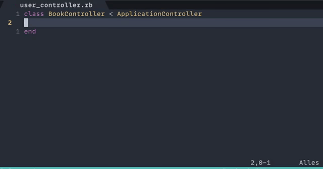
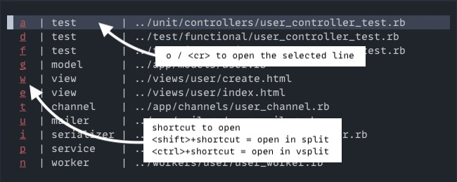

# other.nvim

Open alternative files for the current buffer.

## tl;dr

This plugin allows you to open associated files for the currently active buffer. For example, while editing a controller, you can conveniently open a view, model, or testcase without using a fuzzy finder or tree.

The plugin is inspired by plugins like [a.vim](https://github.com/vim-scripts/a.vim), [vim-projectionist](https://github.com/tpope/vim-projectionist) or [AltN8](https://plugins.jetbrains.com/plugin/1475-altn8)

#### The plugin in a rails project.



The plugin opens a file picker when there's no perfect match. By default it memorizes the selection.

## Dependencies

Neovim > 0.7

## Usage

After setting up the plugin with builtin or custom mapping, it provides this set of command:

| Command        | Description                                                           |
| -------------- | --------------------------------------------------------------------- |
| `:Other`       | Opens the other/alternative file according to the configured mapping. |
| `:OtherTabNew` | Like `:Other`but opens the file in a new tab.                         |
| `:OtherSplit`  | Like `:Other`but opens the file in an horizontal split.               |
| `:OtherVSplit` | Like `:Other`but opens the file in a vertical split.                  |

For each command you can pass an optional `context` which is described under mappings.
For example `:Other test` could be used to open the testcase for the current buffer.

The last list of possible matches is stored in the global variable `vim.g.other_lastmatches`. The last file opened with the plugin is stored in the global variable `vim.g.other_lastopened`. This might be useful for integration with other plugins.

### Keybindings

When the file-picker is opened it can be used with the following keybindings:


💡 Additionally you can open the selected line in a split without the shortcut by pressing `s` and `v` to open it in a vertical split.

The default keybindings can be overwritten using the keybindings table in the config:

```
	keybindings = {
		["<cr>"] = "open_file_by_command()", -- Open the file with last opening command based on how the filepicker was initially opened. (Other, OtherTab, OtherSplit, OtherVSplit)
		["<esc>"] = "close_window()",
		o = "open_file()",
		q = "close_window()",
		v = "open_file_vs()", -- open file in a vertical split
		s = "open_file_sp()", -- open file in a horizontal split
	},
```

## Installation / Setup

```
Plug 'rgroli/other.nvim'
```

After the installation the plugin needs to be initialized. When you're using an `init.lua` a setup could look like:

```lua
require("other-nvim").setup({
    mappings = {
        -- builtin mappings
        "livewire",
        "angular",
        "laravel",
        "rails",
        "golang",
        "python",
        "react",
        "rust",
        -- custom mapping
        {
            pattern = "/path/to/file/src/app/(.*)/.*.ext$",
            target = "/path/to/file/src/view/%1/",
            transformer = "lowercase"
        }
    },
    transformers = {
        -- defining a custom transformer
        lowercase = function (inputString)
            return inputString:lower()
        end
    },
    style = {
        -- How the plugin paints its window borders
        -- Allowed values are none, single, double, rounded, solid and shadow
        border = "solid",

        -- Column seperator for the window
        seperator = "|",

	-- width of the window in percent. e.g. 0.5 is 50%, 1.0 is 100%
	width = 0.7,

	-- min height in rows.
	-- when more columns are needed this value is extended automatically
	minHeight = 2
    },
})
```

A simple configuration with basic keybinding would look like:

```lua
require("other-nvim").setup({
	mappings = {
		"livewire",
		"angular",
		"laravel",
		"rails",
		"golang",
		"python",
        "react",
		"rust",
	},
})

vim.api.nvim_set_keymap("n", "<leader>ll", "<cmd>:Other<CR>", { noremap = true, silent = true })
vim.api.nvim_set_keymap("n", "<leader>ltn", "<cmd>:OtherTabNew<CR>", { noremap = true, silent = true })
vim.api.nvim_set_keymap("n", "<leader>lp", "<cmd>:OtherSplit<CR>", { noremap = true, silent = true })
vim.api.nvim_set_keymap("n", "<leader>lv", "<cmd>:OtherVSplit<CR>", { noremap = true, silent = true })
vim.api.nvim_set_keymap("n", "<leader>lc", "<cmd>:OtherClear<CR>", { noremap = true, silent = true })

-- Context specific bindings
vim.api.nvim_set_keymap("n", "<leader>lt", "<cmd>:Other test<CR>", { noremap = true, silent = true })
vim.api.nvim_set_keymap("n", "<leader>ls", "<cmd>:Other scss<CR>", { noremap = true, silent = true })
```

After the installation the following commands are offered:

| Value        | Description                                                                                                                                                                                                                                                                                                                                                                                                                                                         |
| ------------ | ------------------------------------------------------------------------------------------------------------------------------------------------------------------------------------------------------------------------------------------------------------------------------------------------------------------------------------------------------------------------------------------------------------------------------------------------------------------- |
| :Other       | Tries to open the other/alternative file based on the configured mappings. When there is a perfect match the corresponding file will be opened. If there are multiple candidates, a file picker will be opened. After picking a file, the two files hold an internal reference to each other. In that way you only have to pick the other/alternative file once. This behaviour can be turned off by setting the configuration-option `rememberBuffers` to `false`. |
| :OtherTabNew  | Same as `:Other` but the file is opened in a new tab.                                                                                                                                                                                                                                                                                                                                                                                                      |
| :OtherSplit  | Same as `:Other` but the file is opened in a horizontal split.                                                                                                                                                                                                                                                                                                                                                                                                      |
| :OtherVSplit | Same as `:OtherSplit` but the split is vertical.                                                                                                                                                                                                                                                                                                                                                                                                                    |
| :OtherClear  | Clears the internal reference to the other/alternative file. Afterwards a file picker will be opened again if there are multiple matches for the current file.                                                                                                                                                                                                                                                                                                      |

The commands `:Other`, `:OtherSplit` and `:OtherVSplit` accept the optional parameter `context`. When the context is provided only the mappings with the given context are used for looking up the corresponding file. This can be useful to open specific files like stylesheets, models, tests, etc. and bind that to a specific key.

## Configuration

To adjust the behavior of the plugin, you the pass a configuration to the setup function.
The default-configuration looks like:

```lua
-- default settings
local defaults = {

	-- by default there are no mappings enabled
	mappings = {},

	-- default transformers
	transformers = {
		camelToKebap = transformers.camelToKebap,
		kebapToCamel = transformers.kebapToCamel,
		pluralize = transformers.pluralize,
		singularize = transformers.singularize,
	},

	-- Should the window show files which do not exist yet based on
	-- pattern matching. Selecting the files will create the file.
	showMissingFiles = true,

	-- When a mapping requires an initial selection of the other file, this setting controls,
	-- wether the selection should be remembered for the current user session.
	-- When this option is set to false reference between the two buffers are never saved.
	-- Existing references can be removed on the buffer with :OtherClear
	rememberBuffers = true,

	keybindings = {
		["<cr>"] = "open_file_by_command()",
		["<esc>"] = "close_window()",
		t = "open_file_tabnew()",
		o = "open_file()",
		q = "close_window()",
		v = "open_file_vs()",
		s = "open_file_sp()",
	},

	hooks = {
		-- This hook which is executed when the file-picker is shown.
		-- It could be used to filter or reorder the files in the filepicker.
		-- The function must return a lua table with the same structure as the input parameter.
		--
		-- The input parameter "files" is a lua table with each entry containing:
		-- @param table (filename (string), context (string), exists (boolean))
		-- @return table | boolean When an empty table or false is returned the filepicker is not openend.
		filePickerBeforeShow = function(files)
			return files
		end,

		-- This hook is called whenever a file is about to be opened.
		-- One example how this can be used: a non existing file needs to be opened by another plugin, which provides a template.
		--
		-- @param filename (string) the full-path of the file
		-- @param exists (boolean) doess the file already exist
		-- @return (boolean) When true (default) the plugin takes care of opening the file, when the function returns false this indicated that opening of the file is done in the hook.
		onOpenFile = function(filename, exists)
			return true
		end,

        	-- This hook is called whenever the plugin tries to find other files.
		-- It returns the matches found by the plugin. It can be used to filter or reorder the files or use the matches with another plugin.
		--
		-- @param matches (table) lua table with each entry containing: (filename (string), context (string), exists (boolean))
		-- @return (matches) Make sure to return the matches, otherwise the plugin will not work as expected.
		onFindOtherFiles = function(matches)
			return matches
		end,

	},

	style = {
		-- How the plugin paints its window borders
		-- Allowed values are none, single, double, rounded, solid and shadow
		border = "solid",

		-- Column seperator for the window
		seperator = "|",

		-- Indicator showing that the file does not yet exist
		newFileIndicator = "(* new *)",

		-- width of the window in percent. e.g. 0.5 is 50%, 1 is 100%
		width = 0.7,

		-- min height in rows.
		-- when more columns are needed this value is extended automatically
		minHeight = 2,
	},

}
```

| Value             | Description                                                                        |
| ----------------- | ---------------------------------------------------------------------------------- |
| `mappings`        | Settings to find other/alternative files for the current buffer.                   |
| `transformers`    | List of functions which are used to transform values when mapping the target file. |
| `rememberBuffers` | When this option is set to false the reference between two buffers is never saved. |
| `style`           | Options to change the appearance of the window.                                    |
| `hooks`           | Lua functions to modify the behaviour of plugin events |

### Mappings

Mappings are the heart of the plugin and describe how to find the other/alternative file for the current buffer.

For example in an angular project, the mapping of a HTML-template to a typescript component and vice-versa can be done as follows:

```lua
require("other-nvim").setup({
    mappings = {
		{
			pattern = "/src/app/(.*)/.*.ts$",
			target = "/src/app/%1/%1.component.html",
            		context = "component" -- optional
		},
		{
			pattern = "/src/app/(.*)/.*.html$",
			target = "/src/app/%1/%1.component.ts",
            		context = "view"
		}
	}
})
```

The mapping between a controller and a view file in a laravel project can be done with:

```lua
require("other-nvim").setup({
    mappings = {
        	{
        		pattern = "/app/Http/Controllers/(.*)Controller.php$",
        		target = "/resources/views/%1/",
                	context = "controller"
        		transformer = "camelToKebap",
        	},
        	{
        		pattern = "/resources/views/(.*)/.*",
        		target = "/app/Http/Controllers/%1Controller.php",
                	context = "view"
        		transformer = "kebapToCamel",
        	},
	}
})
```

Mapping multiple targets to one filetype (in this case .ts to .html or .spec.ts) can be done like:

```lua
require("other-nvim").setup({
    mappings = {
		{
			pattern = "/src/app/(.*)/.*.ts$",
			target = "/src/app/%1/%1.component.html",
            		context = "component"
		},
		{
			pattern = "/src/app/(.*)/.*.html$",
			target = "/src/app/%1/%1.component.ts",
            		context = "view"
		},
		{
			pattern = "/src/app/(.*)/.*.ts$",
			target = "/src/app/%1/%1.component.html",
            		context = "component"
		},
		{
			pattern = "/src/app/(.*)/.*.spec.ts$",
			target = "/src/app/%1/%1.component.html",
            		context = "test"
		},
	}
})
```

this can even be described in shorter syntax:

```lua
require("other-nvim").setup({
    mappings = {
    	{
            pattern = "/(.*)/(.*)/.*.ts$",
            target = {
                {
                    target = "/%1/%2/%2.component.html",
                    context = "html"
                },
                {
                    target = "/%1/%2/%2.component.spec.ts",
                    context = "test"
                }
            }
        }
	},
})
```

💡 Mappins also allow for using glob-like patterns in the pattern-section:

```lua
require("other-nvim").setup({
    mappings = {
		--- [...]
		{
		    pattern = "/src/(.*)/.*.js$",
		    target = "/src/%1/\\(*.css\\|*.scss\\)",
		},
})
```

**Special characters need to be escaped with double slashes.**

A mapping can have the following settings:

| Setting                  | Description                                                                                                                                                                                                                        |
| ------------------------ | ---------------------------------------------------------------------------------------------------------------------------------------------------------------------------------------------------------------------------------- |
| `pattern`                | A regular expression to find an available mapping for the current buffer. The pattern can have one ore more capturing group `(.*)` which can be used in the target setting.                                                        |
| `target`                 | A string to resolve the other/alternative file. The `%1` in the string represents a match in the first capturing group of the pattern. `%2` would reference a second capturing group                                               |
| `transformer` (optional) | A function to transform the captured group of the pattern before it is used in the target.                                                                                                                                         |
| `context` (optional)     | A string defining an extra context beyond the standard mapping. An example would be "test" for opening the test case of a component. The context is also used to display additional information when picking a file in the window. |

💡 **Escaping in 'pattern'**

When using regexes in the pattern be aware that some characters need to be escaped with an `%`.
These characters need escaping when they should be used literally: `( ) . % + - * ? [ ^ $`

For instance when something like `some-folder` is part of the pattern it should be written as `some%-folder`.

💡 Mappings also support function-based patterns for more complex matching logic:

```lua
require("other-nvim").setup({
    mappings = {
        {
            -- Function receives the current file path and should return
            -- captures to use in the target pattern, or nil if no match
            pattern = function(file)
                local match = file:match("/src/components/(.*)/index.tsx$")
                if match then
                    return {match, "component"}  -- Returns captures as table
                end
                return nil  -- No match
            end,
            target = "/src/tests/%1/%2.test.tsx",
            context = "test"
        }
    }
})
```

Function-based patterns are useful when:
- You need more complex logic to determine if a file matches
- You want to extract multiple captures with custom processing
- Regular expressions alone aren't sufficient
- You need to check external conditions

The function should:
- Take a single parameter (the current file path)
- Return a table of captures to use in the target pattern (like `%1`, `%2`, etc.)
- Return nil if the pattern doesn't match

The captures returned by the function can be used in the target pattern just like regex captures, and can also be transformed using transformers.

#### Builtin Mappings

Right now there are builtin mappings for
* `angular`
* `c`
* `rails`
* `golang`
* `laravel`
* `livewire`
* `python`
* `react`
* `rust`

The rails mappings now include functionality for the the testframeworks `minitest` and `rspec`.

The implementation of the mappings is straightforward and can be viewed [here](https://github.com/rgroli/other.nvim/blob/main/lua/other-nvim/builtin/mappings/). I'd ❤️ to see contributions to extend this list.
To use the builtin mappings they can be passed as string to the mappings in the setup.

💡 If there are multiple mappings matching the current path a file picker will be shown to select the desired file.

#### Non existing files

When `showMissingFiles` is true, the plugin also displays files that have a matching mapping but do not exist yet.

The configuration option `newFileIndicator` is the string which is displayed in front of the non-existing file.
When the file is opened with the file picker it is created.

To apply more custom logic like for instance using another plugin to prepopulate the contents of the created file based on a template, it is also possible to use the `onOpenFile` hook.

### Transformers

Transformers are lua functions to transform the captured group of the pattern before being used in the target.
Right now the plugin has two builtin transformers `camelToKebap` and `kebapToCamel`.

It is easy to create a custom transformers in the setup as well. A transformer must have this signature:

```lua
function (inputString)
   -- transforming here
   return transformedValue;
end
```

Custom transformers are defined in the setup and can directly used in the mappings. In this example the custom `lowercase` transformer.

```lua
require("other-nvim").setup({
    -- [...]
    mappings = {
        -- custom mapping
        {
            pattern = "/path/to/file/src/app/(.*)/.*.ext$",
            target = "/path/to/file/src/view/%1/",
            transformer = "lowercase"
        }
    },
    transformers = {
        lowercase = function (inputString)
            return inputString:lower()
        end
    },
    -- [...]
})
```

