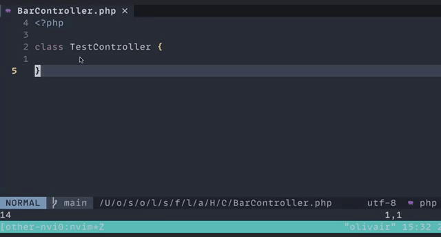

# other.nvim
Open alternative files for the current buffer.

## tldr; ##
With this plugin you can open other/related files for the currently active buffer.
For instance when editing a controller you can easily open a view, a model or a testcase without the need to open a fuzzy finder or a tree.

#### The plugin in action in an angular project.


#### The plugin in action in a php project.


The plugin opens a file picker, when there is no perfect match. By default the plugin memorizes the selection.

## Dependencies ##
Neovim > 0.5

## Usage ##
After setting up the plugin with some builtin or custom mapping, the plugin provides this set of command:

| Command   | Description |
|--------------|-----------|
| `:Other` |Opens the other/alternative file according to the configured mapping.   |
| `:OtherSplit`  | Like `:Other`but opens the file in an horizontal split. |
| `:OtherVSplit`  | Like `:Other`but opens the file in a vertical split. |

For each command you can pass an optional `context` which are described under mappings.
For example `:Other test` could be used to open the testcase for the current buffer.


## Installation / Setup ##
```
Plug 'rgroli/other.nvim'
```

After the installation the plugin needs to be initialized. When you're using a `init.lua` an example setup could look like:
```lua
require("other-nvim").setup({
    mappings = {
        -- builtin mappings
        "livewire",
        "angular",
        "laravel",
        -- custom mapping
        {
            pattern = "/path/to/file/src/app/(.*)/.*.ext$",
            target = "/path/to/file/src/view/%1/",
            transformer = "lowercase"
        }
    },
    transformers = {
        -- defining a custom transformer
        lowercase = function (inputString)
            return inputString:lower()
        end
    }
})
```

A simple configuration with basic keybinding would look like:

```lua
require("other-nvim").setup({
	mappings = {
		"livewire",
		"angular",
		"laravel",
	},
})

vim.api.nvim_set_keymap("n", "<leader>ll", "<cmd>:Other<CR>", { noremap = true, silent = true })
vim.api.nvim_set_keymap("n", "<leader>lp", "<cmd>:OtherSplit<CR>", { noremap = true, silent = true })
vim.api.nvim_set_keymap("n", "<leader>lv", "<cmd>:OtherVSplit<CR>", { noremap = true, silent = true })
vim.api.nvim_set_keymap("n", "<leader>lc", "<cmd>:OtherClear<CR>", { noremap = true, silent = true })

-- Context specific bindings
vim.api.nvim_set_keymap("n", "<leader>lt", "<cmd>:Other test<CR>", { noremap = true, silent = true })
vim.api.nvim_set_keymap("n", "<leader>ls", "<cmd>:Other scss<CR>", { noremap = true, silent = true })
```

After the installation the plugin offers the following commands:

| Value   | Description |
|--------------|-----------|
| :Other | Tries to open the other/alternative file based on the configured mappings. When there is a perfect match the corresponding file will be opened. If there are multiple candidates, a file picker will be opened. After picking a file, the two files hold an internal reference to each other. In that way you only have to pick the other/alternative file once. This behaviour can be turned off by setting the configuration-option `rememberBuffers` to `false`.|
| :OtherSplit | Same as `:Other` but the file is opened in a horizontal split.|
| :OtherVSplit | Same as `:OtherSplit` but the split is vertical.|
| :OtherClear | Clears the internal reference to the other/alternative file. After doing that a file picker will be opened again if there are multiple matches for the current file. |

The commands `:Other`, `:OtherSplit` and `:OtherVSplit` accept the optional parameter `context`. When the context is provided only the mappings with the given context are used for looking up the corresponding file. This can be useful to open specific files like stylesheets, models, tests, etc. and bind that to a specific key.


## Configuration
To adjust the behavior of the plugin, you the pass a configuration to the setup function.
The default-configuration looks like:

```lua
-- default settings
local defaults = {

	-- by default there are no mappings enabled
	mappings = {},

	-- default transformers
	transformers = {
		camelToKebap = transformers.camelToKebap,
		kebapToCamel = transformers.kebapToCamel,
	},

	-- When a mapping requires an initial selection of the other file, this setting controls
	-- wether the selection should be remembered for the current user session.
	-- When this option is set to false the reference between the two buffers is never saved.
	-- Existing references can be removed on the buffer with :OtherClear
	rememberBuffers = true,
}
```

| Value   | Description |
|--------------|-----------|
| `mappings` | Settings for finding other/alternative files for the current buffer. |
| `transformers`  | List of functions which are used to transform values when mapping the target file. |
| `rememberBuffers`  | When this option is set to false the reference between two buffers is never saved.|


### Mappings ###
Mappings are the heart of the plugin and describe how to find the other/alternative file for the current buffer.

For example in an angular project, the mapping of a HTML-template to a typescript component and vice-versa can be done as follows:
```lua
require("other-nvim").setup({
    mappings = {
		{
			pattern = "/src/app/(.*)/.*.ts$",
			target = "/src/app/%1/%1.component.html",
		},
		{
			pattern = "/src/app/(.*)/.*.html$",
			target = "/src/app/%1/%1.component.ts",
		}
	}
})
```

The mapping between a controller and a view file in a laravel project can be done with:
```lua
require("other-nvim").setup({
    mappings = {
        	{
        		pattern = "/app/Http/Controllers/(.*)Controller.php$",
        		target = "/resources/views/%1/",
        		transformer = "camelToKebap",
        	},
        	{
        		pattern = "/resources/views/(.*)/.*",
        		target = "/app/Http/Controllers/%1Controller.php",
        		transformer = "kebapToCamel",
        	},
	}
})
```

💡 Mappins also allow for using glob-like patterns in the pattern-section:
```lua
require("other-nvim").setup({
    mappings = {
		--- [...]
		{
		    pattern = "/src/(.*)/.*.js$",
		    target = "/src/%1/\\(*.css\\|*.scss\\)",
		},
		--- [...]
	}
})
```
**Special characters need to be escaped with double slashes.**

A mapping can have the following settings:

| Setting   | Description |
|--------------|-----------|
| `pattern` | A regular expression for finding an available mapping for the current buffer. The pattern can have one ore more capturing group `(.*)` which can be used in the target setting.      |
| `target`  | A string for resolving the other/alternative file. The `%1` in the string represents a match in the first capturing group of the pattern. `%2` would reference a second capturing group |
| `transformer` (optional) | A function to transform the captured group of the pattern before it is used in the target.|
| `context` (optional) | A string defining an extra context beyond the standard mapping. An example would be "test" for opening the test case of a component. |

💡 **Escaping in 'pattern'** 

When using regexes in the pattern be aware that some characters need to be escaped meaning that they need to be prepended with a `%`. 
These characters need escaping when they should be used literally: `( ) . % + - * ? [ ^ $`

For instance when something like `some-folder` is part of the pattern it should be written as `some%-folder`.


#### Builtin Mappings ####
Right now there are builtin mappings for `angular`, `laravel` and `livewire`. The implementation of the mappings is straightforward and can be viewed [here](https://github.com/rgroli/other.nvim/blob/main/lua/other-nvim/builtin/mappings.lua). I'd ❤️ to see contributions to extend this list.
To use the builtin mappings they can be passed as string to the mappings in the setup.

```lua
require("other-nvim").setup({
    -- [...]
    mappings = {
        "livewire",
        "laravel",
        "angular"
    }
    -- [...]
})
```
💡 Beware that the order in which the mappings are defined in the setup matters! The first match will be always be used.

### Transformers ###
Transformers are lua functions to transform the captured group of the pattern before being used in the target.
Right now the plugin has two builtin transformers `camelToKebap` and `kebapToCamel`.

It is easy to create a custom transformers in the setup as well. A transformer must have this signature:
```lua
function (inputString)
   -- transforming here
   return transformedValue;
end
```

Custom transformers are defined in the setup and can directly used in the mappings. In this example the custom `lowercase` transformer.

```lua
require("other-nvim").setup({
    -- [...]
    mappings = {
        -- custom mapping
        {
            pattern = "/path/to/file/src/app/(.*)/.*.ext$",
            target = "/path/to/file/src/view/%1/",
            transformer = "lowercase"
        }
    },
    transformers = {
        lowercase = function (inputString)
            return inputString:lower()
        end
    },
    -- [...]
})
```
